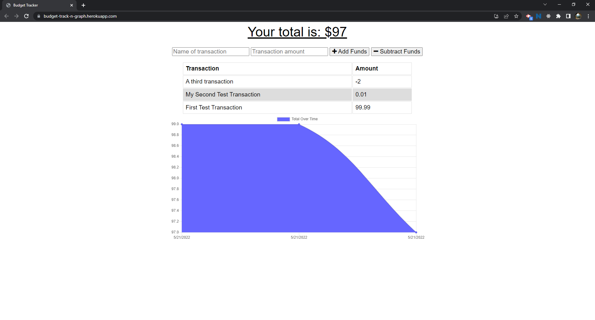

# budgeTrack
## An application by H0RSESH0E  
&nbsp;  
  
&nbsp;&nbsp;  
## Table of Contents
#### [Description](#description)  -  [Installation](#installation)  -  [Usage](#usage) - [License](#license) - [Contributing](#contributing) - [Tests](#tests) - [Questions](#questions)
&nbsp;  
## Description  
This project added PWA functionality to a simple budget tracker.  By opening an indexedDB database, registering a service worker, writing a Web Manifest and deploying the application to Heroku (linking to MongoDB Atlas) I was able to upgrade the bugeTrack application significantly.  
&nbsp;  
    
      
&nbsp;  
## [Deployment Link](https://budget-track-n-graph.herokuapp.com/)  
&nbsp;  
## Installation
N/A  
&nbsp;  
## Usage
N/A  
&nbsp;  
## License  

**The Unlicense**  
A license with no conditions whatsoever which dedicates works to the public domain. Unlicensed works, modifications, and larger works may be distributed under different terms and without source code.  
[View the full license here.](./LICENSE/license.txt)  
&nbsp;  
## Contributing
N/A  
&nbsp;  
## Tests
N/A  
&nbsp;  
## Questions
Questions or concerns about the project or how to contribute to its development can be emailed to: **dcpb777@gmail.com**  
&nbsp;  
&nbsp;  
  
  
**[Visit me on GitHub](https://github.com/H0RSESH0E)**  
